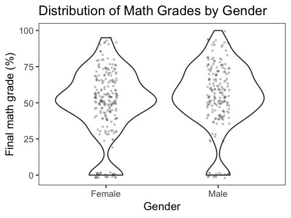
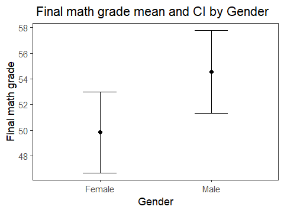

Sarah Watts and Orphelia Ellogne
2018-11-22

The relationship between gender and math grades
-----------------------------------------------

Our goal of this project is to understand if there is a statistically significant difference in the mean final grade for male and female students in the [UCI Student Performance dataset](https://archive.ics.uci.edu/ml/datasets/Student+Performance). This dataset is comprised of the final math grade achieved in secondary education for two Portuguese schools. This question was chosen because it explores the area of research surrounding the gender gap in STEM. Researches such as Wharton's health care management professor Ashley Swanson have cited the gender gap for performance in secondary school mathematics as a leading cause for the gender gap in pay. This supports the need for research in this area (Knowledge @ Wharton, 2018).

The data
--------

Each row in the UCI Student Performance dataset represents a student. There are two columns in this dataset that will be analyzed, sex and final\_math\_grade. Sex is a categorical variable that contains the values `female` and `male`. final\_math\_grade is a continous variable that ranges from 0-100, based on the final grade percentage earned by a student.

Table 1: Sample rows from the UCI Student Performance dataset

| sex    |  final\_math\_grade|
|:-------|-------------------:|
| Female |                  30|
| Female |                  30|
| Female |                  50|
| Female |                  75|
| Female |                  50|
| Male   |                  75|

There are 395 students present in this dataset, 208 are female and 187 are male. The distribution of final math grades are shown below. Female students are more highly concentrated around the 50% range than male students. There are also more female students who scored 0% in their math class. Only male students have scored the top grade of 100%. However, overall the distributions are similar in shape.

Figure 1: Distirbution of math grades by gender

Overall, final math grade is primarily concentrated between 45%-70%, with a mean of grade 52%. This is visible in the mean and confidence interval graph below.

Figure 2: Final math grade mean and confidence interval by gender

### Findings

To determine if there was a statistically significant difference in the mean math grade for male and female students a null and an alternative hypothesis was defined.

*H*0: mean of female student math grades = mean of male student math grades
*H**A*: mean of female student math grades ≠ mean of male student math grades

The null hypothesis is that the mean math grade for male and female students is equal, whereas the alternative hypothesis is that they are not. Since the distributions are similar, a two tail test was selected.

Table 2: Hypothesis test results for *H*0: mean of female student math grades = mean of male student math grades

| method                  | alternative |   p.value|
|:------------------------|:------------|---------:|
| Welch Two Sample t-test | two.sided   |  0.039577|

The resulting p-value from the Welch two sample t-test (which was selected to compare the two means) is 0.039577. To be 95% confident in the findings of this t-test an alhpa value of 0.05 is selected. Therefore, since the p-value is less than alpha (at 0.039577), the null hypothesis is rejected and the alternative hypothesis is accepted.

The alternative hypothesis is that gender does have an impact on the mean grade obtained by students at these two Portuguese schools. This is a disappointing finding in the hope for gender equality.

### Limitations and future directions

This analysis has two main limitations. First, the study sample is not representative of all students because the data was collected from two Portuguese schools. Hence, it is possible that the statistically significant results may not be generalized to students in other schools and/or countries.

Second, the study does not consider other demographic and social variables such as family size, family income and parents' education that could also impact a student achievement. This means that the results could suffer from omitted variables bias.

In the future, these limitations could be overcome by performing a multiple linear regression analysis with a more diverse dataset. This approach will estimate whether math grades vary by gender while other explanatory variables are held fixed.

In spite of these limitations, the results are consistent with existing researches findings (Ghazvini and Khajehpour, 2011; Abdu Raheem, 2017)

### References

Ghazvini, Sayid and Khajehpour, Milad. (2011). Gender differences in factors affecting academic performance of high school students.

Abdu Raheem B.O.(2017-10-09).The Influence of Gender on Secondary School Students' Academic Performance in South-West, Nigeria.

Knowledge @ Warton, (2018). Among Top Math Students, Why Does a Gender Gap Persist?. <http://knowledge.wharton.upenn.edu/article/gender-gap-mathematics-achievement/>
